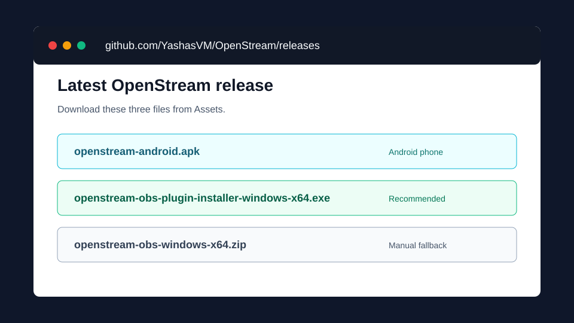
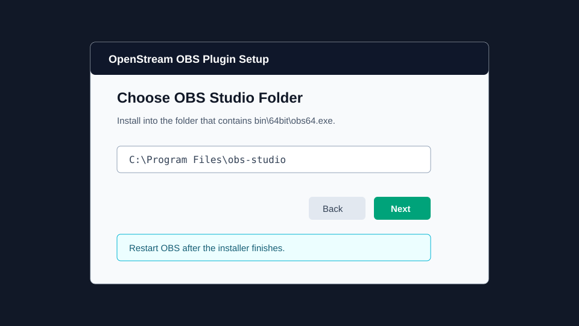
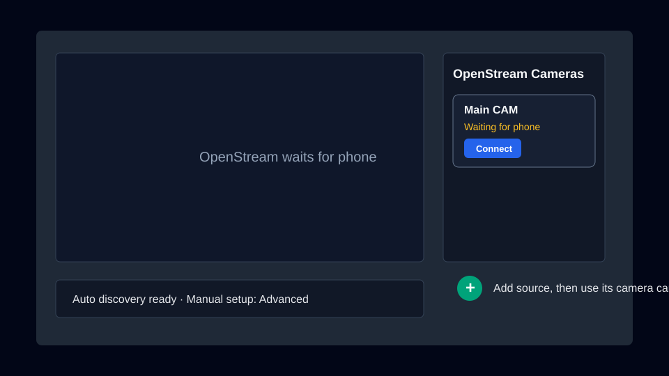
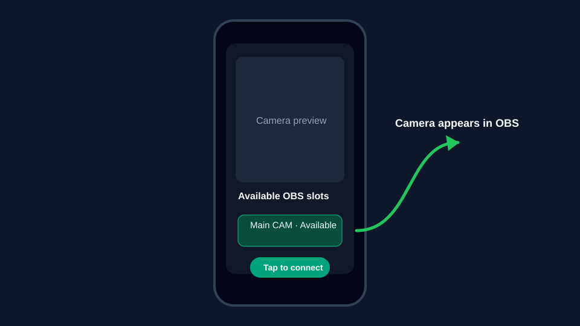

# OpenStream Set-Up Guide

This guide is the slower, screenshot-led path for installing OpenStream on an Android phone and a Windows OBS Studio PC.

For the fast technical version, use the [README quick start](../README.md#quick-start).

---

## What You Need

| Requirement | Details |
|---|---|
| Android phone | Android 10 or newer is recommended. The phone must support Camera2. |
| Windows PC | OBS Studio installed on Windows x64. |
| Same network | Phone and PC must be on the same Wi-Fi or LAN subnet. |
| Release files | APK for the phone, installer EXE for the OBS plugin. |

> [!TIP]
> If discovery does not work, temporarily disable VPNs, guest Wi-Fi, and router client isolation.

---

## 1. Download the Release Files

Open the latest OpenStream release and download:

| File | Install on | Use |
|---|---|---|
| [`openstream-android.apk`](https://github.com/YashasVM/OpenStream/releases/latest/download/openstream-android.apk) | Android phone | Installs the camera app. |
| [`openstream-obs-plugin-installer-windows-x64.exe`](https://github.com/YashasVM/OpenStream/releases/latest/download/openstream-obs-plugin-installer-windows-x64.exe) | Windows PC | Installs the OBS plugin automatically. |
| [`openstream-obs-windows-x64.zip`](https://github.com/YashasVM/OpenStream/releases/latest/download/openstream-obs-windows-x64.zip) | Windows PC | Manual fallback package. |



> [!NOTE]
> The GitHub page also shows `Source code` downloads. Those are for developers. Most users only need the APK and installer EXE.

---

## 2. Install the Android App

1. Move `openstream-android.apk` to your Android phone.
2. Open the APK from your Downloads app or file manager.
3. If Android blocks the install, allow installs from that app when prompted.
4. Open `OpenStream`.
5. Allow camera and microphone permissions.

The app should open directly into a camera preview.

---

## 3. Install the OBS Plugin on Windows

1. Close OBS Studio.
2. Run `openstream-obs-plugin-installer-windows-x64.exe`.
3. Accept the Windows administrator prompt.
4. Keep the OBS folder as `C:\Program Files\obs-studio` unless you installed OBS somewhere else.
5. Finish the installer.
6. Reopen OBS Studio.



The installer copies `openstream-obs.dll` into:

```text
C:\Program Files\obs-studio\obs-plugins\64bit\
```

### Manual Plugin Install

Use this only if the installer EXE is blocked or you want to inspect the files first.

1. Download `openstream-obs-windows-x64.zip`.
2. Extract the zip.
3. Right-click `install-openstream-plugin.bat`.
4. Choose `Run as administrator`.
5. Restart OBS Studio.

You can also copy the DLL yourself:

```text
openstream-obs.dll -> C:\Program Files\obs-studio\obs-plugins\64bit\openstream-obs.dll
```

---

## 4. Add OpenStream in OBS

1. Open OBS Studio.
2. In `Sources`, click `+`.
3. Choose `OpenStream`.
4. Keep auto-connect enabled.
5. Leave the default SRT port as `9000`.
6. Leave latency at `120 ms` for the first test.
7. Click OK.



The source can stay blank until a phone connects.

---

## 5. Connect the Phone

1. Put the phone and PC on the same Wi-Fi network.
2. Open OpenStream on the phone.
3. Wait for the OBS device to appear.
4. Tap the discovered OBS device.
5. The phone camera should appear in OBS.



If the phone does not find OBS, use manual connect:

| Value | Default |
|---|---|
| OBS PC IP address | Your PC's LAN IP, for example `192.168.1.25` |
| SRT port | `9000` |
| Latency | `120` |

---

## 6. Confirm Audio and Controls

In OBS:

1. Look for the OpenStream audio channel in the mixer.
2. Open the OpenStream source properties.
3. Try the zoom slider.
4. Try torch on/off if the selected phone camera supports it.
5. Switch front/back camera from the source properties or phone UI.

---

## Troubleshooting

| Problem | Try |
|---|---|
| Installer cannot find OBS | Re-run it and choose the folder that contains `bin\64bit\obs64.exe`. |
| Windows blocks the EXE | Use `More info` then `Run anyway`, or use the manual zip install. |
| OpenStream source is missing in OBS | Confirm `openstream-obs.dll` is in `C:\Program Files\obs-studio\obs-plugins\64bit\`, then restart OBS. |
| Phone cannot see OBS | Put both devices on the same Wi-Fi, disable VPNs, and check guest/client isolation. |
| Camera stays blank | Start with port `9000`, latency `120 ms`, and one phone only. |
| Audio is missing | Grant microphone permission on Android and check the OBS mixer channel. |
| Stream stutters | Use 5 GHz or Wi-Fi 6, move closer to the router, and avoid congested networks. |

---

## Developer Notes

The Python receiver is a developer/debug path only; it is not part of the normal user workflow.

```powershell
python tools/openstream_receiver.py --port 9000 --latency-ms 120 --ffplay
```

Use it only when debugging SRT transport outside OBS.
